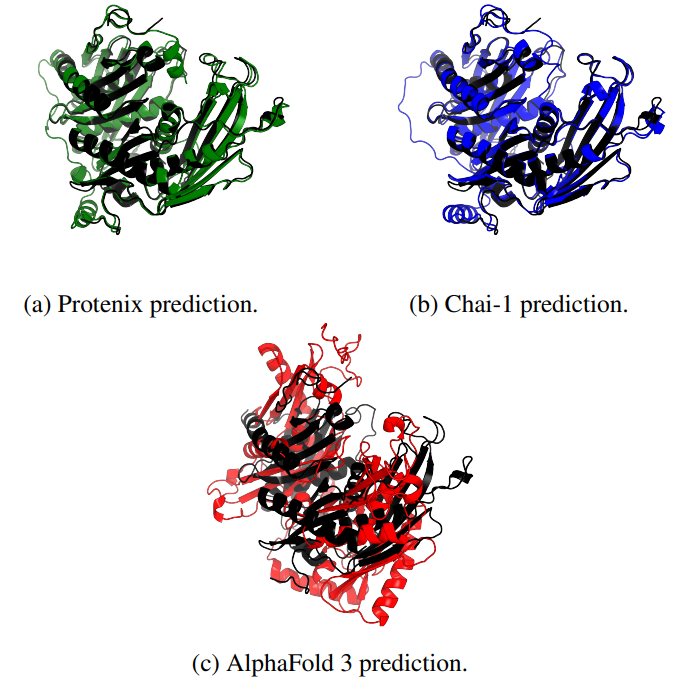

# Benchmarking Diffusion Models for Monomeric Protein Structure Prediction

This repository contains the code and datasets used in our study on systematically benchmarking state-of-the-art AI-powered diffusion models for monomeric protein structure prediction. Our analysis focuses on three leading models—**AlphaFold 3**, **Protenix**, and **Chai-1**—evaluating their accuracy, robustness, and ability to detect subtle 3D structural variations in unseen protein structures.



## Overview

Protein structure prediction is crucial for advancing computational biology, with applications ranging from drug design to understanding biological mechanisms. Recent advancements in diffusion models have revolutionized the field, enabling faster and more accurate predictions. This project explores:

- The predictive performance of AlphaFold 3, Protenix, and Chai-1 on test sets of unseen proteins.
- Sensitivity to single amino acid mutations, analyzing local structural deformation.
- Comparative performance across difficulty levels using metrics like **pLDDT**, **PAE**, **RMSD**, and **pTM**.

## Key Features

- **Dataset**: Includes newly released protein structures from CAMEO (2024) and experimental datasets with mutation-specific comparisons.
- **Metrics**: Comprehensive evaluation using confidence scores, alignment errors, and structural deviations.
- **Code**: Modular implementation for benchmarking diffusion-based prediction models.

# Metrics Analysis

This repository is designed for detailed analysis of metrics using the available data and tools. Follow the steps below to install dependencies and run the Jupyter notebook.

## Requirements

To install the necessary dependencies, ensure you have `pip` or `conda` installed in your environment. Then, run the following command:

### With `pip`

```bash
pip install -r requirements.txt
```

## Running the Notebook

1. **Download the dataset** from [this link](https://drive.google.com/file/d/120cllQGPHg7-JFyVCvFJberP956HvbIg/view?usp=sharing), unzip and place it in data folder.

2. **Install the required dependencies**. Make sure you have all the prerequisites set up, as outlined in the `requirements.txt` file.

3. **Open the `playground.ipynb` notebook** in the Jupyter web interface.

4. **Run the cells** in the notebook to analyze the metrics and explore the results. Each cell is designed to guide you through the analysis step by step.


